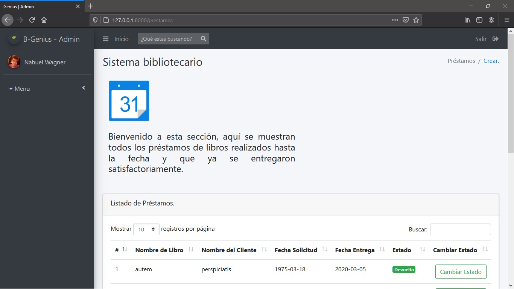
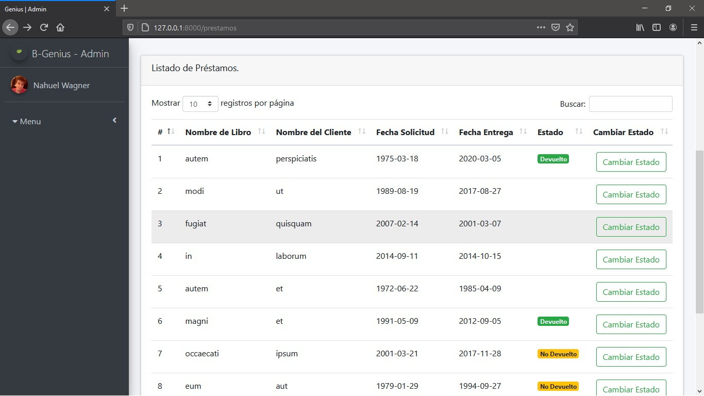

# Sistema Libreria B-Genius

---

## Grupo

    17. Wagner Nahuel.

---

## Visión

Desarrollaremos un sistema que permitira a la biblioteca administrar la misma, que permita al administrador poder generar nuevos usuarios, elminarlos, crear catálogos, realizar prestamos de los libros que mas le agraden a los clientes.

---

## Lista de características

- El sistema debera permitir cargar libros.
- El sistema debera permitir filtar los libros por categorías y por estados.
- Explorar catálogo.
- El sistema debera permitir asignar un estado(nuevo, usado o deteriorado) a un libro.
- El sistema debera permitir asignar una categorÍa a un libro.
- El sistema debe de permitir registrar clientes.
- Prestamos de libros según los gustos de los usuarios.
- El sistema deberá permitir modificar los datos de un Cliente.
- El sistema debera permitir buscar libros en la sección de libros.
- El sistema debera permitir buscar clientes en la sección de clientes.

---

## Análisis de dominio

La aplicación está diseñada en un contexto de, administracion para una biblioteca, asi mismo poder ralizar prestamos de libros.

---

# Sección 1:

## Planificación del sistema B-Genius.

## Historias de usuario

---

### Actores del Sistema.

1. Administrador: el rol de administrador se encarga de la parametrización del sistema (ABM de libros, categorias, control de usuarios, creación de nuevos usuarios).

---

## HU1_Añadir libros

### Actores: Administrador

**como**: usuario administrador del sistema.

**quiero**: poder cargar informacion referente a un nuevo libro.

**para**: tener un nuevo libro cargado en la seccion de catalogos.

**Criterios de aceptacion**

- De completarse de manera exitosa la operacion, el sistema debe de redirigir a la pantalla donde se encuentran los libros.
- La informacion del libro debe de estar completa para poder subirse, en caso contrario, se debe de mostrar un mensaje, y cancelar la operacion.

---

## HU2_Explorar Catálogo

### Actores: Administrador

**Objetivo**: Explorar el catálogo para observar nuevas publicaciones, libros disponibles.

**como**: usuario administrador del sistema.

**quiero**: ver una lista de catalogos y libros que estan disponibles.

**para**: poder decirle  a los usuarios de la biblioteca que libros estan registrados y cuantos ejemplares.

**Criterios de aceptacion**

- El catalogo debe de estar creado, y los libros agregados al mismo.

---

**2da Hiteración**

## HU3_Registrar Clientes.

### Actores Administrador

**Objetivo** Realizar el alta de clientes al sistema.

**como**: usuario administrador del sistema.

**quiero**: quiero poder cargar la informacion referente a un nuevo cliente.

**para**: poder tener un nuevo cliente cargado en el sistema, ver sus datos, editarlos y eliminarlos en caso de ser necesario.

### Criterios de Aceptacion

- De completarse de manera exitosa la operación, el sistema debe de redirigir a la vista donde se encuentra la lista de clientes.
- Si el cliente ya se encuentra cargado en el sitema, debe de mostrarse un mensaje y se debe de cancelar la operacion.
- En caso de querer guardar la infrmación con algun dato faltante o sin completar el sistema debe de mostrar un mensaje de error o alerta indicando que dato esta faltando o que datos es obligatorio.

---

## HU4_Prestamos y Reservaciones.

### Actores Administrador/Cliente

**Objetivo** Realizar la operación de prestamos de uno o varios libros.

**como**: usuario administrador del sistema.

**quiero**: quiero poder asignarle libros a un cliente.

**para**: poder tener un libro asiciado a un prestamo y el prestamo a un cliente.

### Criterios de Aceptacion

- De completarse de manera exitosa la operacion, el sistema debe de redirijir a la vista de prestamos.
- El libro debe de estar cargado en el sistema, debe de tener una cantidad para poder realizar los prestamos.
- El cliente que quiera alquilar este libro debe de estar registado.

---

## HU5_Realizar filtros por Estados y Categorías en la vista de los libros.

### Actores Administrador

**Objetivo** Realizar la operación de filtrado por categorías y estados de uno o varios libros

**como**: usuario administrador del sistema.

**quiero**: quiero poder filtrar libros.

**para**: poder tener un libro filtrado por estados y categorías, según las preferencias de los clientes.

### Criterios de Aceptacion

- De completarse de manera exitosa la operación, el sistema debe de mostrar los resultados de los filtros.
- El libro debe de estar cargado en el sistema.
- La categoría debe de estar creda y asociada a un libro.
- El estado debe de estar creado y asociado a un libro.

---
## Arquitectura

- Editor de Código: Visual Studio Code/Atom.
- Versionado: GitHub.
- Otras herramientas: Boostrap, Html, Css, JavaScript.
- Documentación: Markdown.
- Frameworck: Laravel/Version 5.8.
- Lenguaje: PHP.
- Arquitectura: Cliente/Servidor.
- Plantilla Administrativa: Admin LTE 3.0.0. y Template Nifty.

---

# Sección 2:
## Interfaces graficas de usuarios de B-Genius | Admin. 

---

### Pagina de Bienvenida.

### Pagina de Login/Inicio de Sesión.

### Secciones Administrativas.

## Secciones.

### Secciones de Categorías y lista de Categorías.

### Secciones para crear nuevas Categoías.

### Secciones de Clientes y lista de Clientes.

### Secciones para crear nuevos Clientes.

### Secciones de Libros y Lista de Libros.

### Sección para crear nuevos libros.

### Sección para editár libros.

### Secciones de Prestámos y Lista de Prestámos.

### Sección para crear nuevos Prestámos.

### Estas son capturas de las vistas del sistema, de cada una de las secciones. Para explicar mejor su funcionamiento se hara un video.
